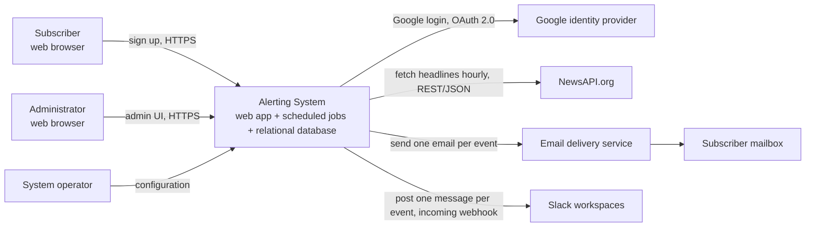

# Alerting System - Requirements Specification

## 1. Document info

| Item | Value |
|---|---|
| Title | Alerting System - High-level Requirements Specification |
| Version | 0.3 |
| Date | 2026-09-30 |
| Status | Draft |
| Source document | `docs/00-project-overview.md` (initial requirements and decisions in Section 3) |
| Author | Business Analyst (Claude Code, `business-analyst` skill) |

Change history:

| Version | Change |
|---|---|
| 0.1 | First draft from the brief. |
| 0.2 | Applied the revised proposed defaults in Section 13 (Q-04, Q-05, Q-09): hourly collection, delivery after each collection run, one message per event instead of a daily digest. |
| 0.3 | Brief updated (Decision 9): hourly collection, events sent one by one, CET time zone. Demo scope: privacy/anti-spam compliance and event freshness are not goals (CON-11, CON-12). Removed FR-06, FR-07, FR-22, NFR-06 and RSK-01, RSK-02, RSK-03, RSK-10; removed IDs are not reused. Digest wording removed from Section 13. |

How to read this document:

- The decisions in Section 3 of the brief are binding. Where they differ from the original stakeholder quote, the decisions win and the difference is recorded as a risk or open question.
- The proposed defaults in Section 13 are the current working decisions.
- The `Claude >` Q&A blocks in the brief were used as background only.
- **Assumptions** (`ASM-xx`) fill small gaps. **Open questions** (`Q-xx`) need a decision from the product owner; each has a proposed default so work can continue.
- Priorities use MoSCoW: **M**ust, **S**hould, **C**ould, **W**on't (this release).

## 2. Introduction

### 2.1 Purpose

This document describes what the Alerting System must do and how well it must do it. It is the input for scoping (step 4), tool selection (step 5) and architecture design (step 6). It does not prescribe technology beyond the constraints already decided in the brief.

### 2.2 Product vision

The Alerting System is a web application that collects important world events from external sources every hour and forwards each new event, as its own message, to everyone who has subscribed, by email or to a Slack channel. Anyone can subscribe through a simple public web page. Designated administrators sign in with Google to view and remove subscribers. Sources and delivery channels are designed to be pluggable so that more can be added later.

### 2.3 Glossary

| Term | Meaning |
|---|---|
| Event | One piece of important information (for example a news headline) stored in the system's standard format: date and time, title, content, source. |
| Source | An external service the system collects events from. Initially NewsAPI.org headlines. |
| Collection run | One execution of the scheduled job that fetches new events from all enabled sources. Default: every hour. |
| Subscriber | A registered recipient of events. Either an email subscriber (name + email address) or a Slack subscriber (Slack incoming webhook URL). |
| Channel | A delivery mechanism for events. Initially Email and Slack. |
| Notification | One message, sent to one subscriber through their channel, that contains exactly one event. |
| Delivery run | The sending of notifications for all events that are new in a collection run. It starts automatically when the collection run ends. |
| Administrator | A designated person who signs in to the admin interface with a Google account. |
| System operator | The person who deploys and configures the system (schedules, sources, credentials). May be the same person as an administrator. |

## 3. Stakeholders and user roles

| Role | Who | Needs | Authentication |
|---|---|---|---|
| Visitor / Email subscriber | Anyone with a web browser and an email address. | Sign up quickly with name and email, receive a notification for each new important event. | None. Public sign-up form. |
| Slack subscriber | Anyone who can create an incoming webhook URL for a Slack channel (as a user or workspace admin). | Register a webhook URL so a channel receives a notification for each new event. | None. Public sign-up form. |
| Administrator | Designated people, allowed by an explicit list of Google accounts. | See who is subscribed, remove subscribers. | Google social login (OAuth 2.0 / OpenID Connect). |
| System operator | The team running the system. | Configure the collection schedule, sources and credentials; monitor that jobs run. | Access to deployment configuration (not through the UI in this release, see ASM-06). |
| Project owner / stakeholder | The author of the brief. | A working demo that follows a documented SDLC process. | n/a |

## 4. Scope

### 4.1 In scope

- Public, responsive web page to subscribe by email (name + email address).
- Public web page to subscribe a Slack channel by incoming webhook URL.
- Scheduled, configurable collection of events from NewsAPI.org headlines (default: every hour).
- Storage of events in one standard format, independent of the source.
- Delivery of each new event as a separate notification to all subscribers by email and Slack, right after each collection run.
- Admin interface with Google login: list subscribers and delete subscribers.
- Pluggable design for adding new sources and new channels later.

### 4.2 Out of scope / future

Taken from the brief and from the Section 13 defaults. These are not specified here, but the design must not block them.

- User preferences, such as news categories, keywords or regions (all subscribers receive the same notifications).
- Unsubscribe function for subscribers (Q-01).
- Digests or any other grouping of several events into one message (Q-09).
- Additional sources: Alpha Vantage (market data), USGS Earthquake API (natural disasters), X/Twitter API and others.
- Additional channels beyond email and Slack.
- Real-time streaming alerts and event freshness. Events reach subscribers at most one collection interval after collection; delays at the source (for example 24 hours on the free NewsAPI.org plan) are accepted for the demo (CON-12).
- Subscriber user accounts, login or self-service profile management.
- Admin functions beyond list and delete (for example editing subscribers, managing sources or schedules through the UI, viewing events).
- Privacy and anti-spam compliance work (for example GDPR notices, removal requests, double opt-in) beyond what the decisions require (CON-11).
- Slack apps with bot tokens or direct messages to individual Slack users (only incoming webhooks are in scope).

## 5. Assumptions and constraints

### 5.1 Assumptions

| ID | Assumption |
|---|---|
| ASM-01 | "Important" means what the source considers top headlines. The system does not rank or filter events for importance on its own. |
| ASM-02 | All subscribers receive the same notifications, because user preferences are out of scope. |
| ASM-03 | "CET" means Central European local time, including the switch to summer time (CEST). |
| ASM-04 | Delivery has no schedule of its own. It starts automatically after each collection run and covers only the events that are new in that run (Q-05). |
| ASM-05 | Administrators are defined by an allow-list of Google account email addresses kept in system configuration. Any other Google account is refused. |
| ASM-06 | Schedules, sources and credentials are changed through configuration by the system operator, not through the admin UI. |
| ASM-07 | Notifications are sent only for new events. If a collection run finds no new events, no message is sent (Q-10). |
| ASM-08 | The same email address or webhook URL can be subscribed only once. |
| ASM-09 | The UI and messages are in English only. |
| ASM-10 | The expected scale for this demonstration is small: up to a few thousand subscribers and a few hundred events per day (on average a few tens per collection run). |

### 5.2 Constraints

| ID | Constraint | Source |
|---|---|---|
| CON-01 | The system is a web application with a classic client-server architecture. | Decision 1 |
| CON-02 | Administrators authenticate with Google social login. | Decision 3 |
| CON-03 | The initial and only source in this release is NewsAPI.org headlines. | Decision 7 |
| CON-04 | Slack delivery uses Slack incoming webhook URLs provided by subscribers. | Decision 5 |
| CON-05 | Events are stored in a standard format: date and time, title, content, source. | Decision 6 |
| CON-06 | Collection runs every hour by default; the operator can configure the interval. Delivery follows each collection run, one message per event. | Decision 9, Q-04, Q-05 |
| CON-07 | No unsubscribe function and no user preferences in this release. | Out of scope list, Q-01 |
| CON-08 | Terms of use and rate limits of NewsAPI.org, Slack and the chosen email delivery service apply. | External services |
| CON-09 | For development and the demo, the free NewsAPI.org developer plan is used. It must not be used for any wider deployment. | Q-06 |
| CON-10 | The system uses the CET time zone for scheduling and for all times shown in messages and the admin UI. | Decision 9 |
| CON-11 | The system is a demonstration. Privacy (GDPR) and anti-spam compliance are not goals of this release, and the related risks are accepted. | Product owner |
| CON-12 | Event freshness is not a goal of the demo. Events may be outdated (for example delayed by 24 hours on the free NewsAPI.org plan). | Product owner, Q-06 |

## 6. High-level system context

The system has four parts at a high level: a public web UI, an admin web UI, a scheduled background job that collects events and then delivers them, and persistent storage (a relational database is the default choice, to be confirmed in design).

## 7. Functional requirements

### 7.1 Subscription

| ID | Requirement | Priority | Acceptance criterion | Source |
|---|---|---|---|---|
| FR-01 | The system must provide a public web page where a visitor can subscribe by entering a name and an email address. | M | A visitor can submit name and email and sees a confirmation message; the subscriber is stored. | Decision 4 |
| FR-02 | The system must validate the email subscription input: name is required, email must have a valid format. | M | Invalid or empty input is rejected with a clear message and nothing is stored. | Decision 4 |
| FR-03 | The system must provide a public web page where a visitor can subscribe a Slack channel by entering a Slack incoming webhook URL, with an optional label. | M | A visitor can submit a webhook URL, with or without a label, and sees a confirmation message; the subscriber is stored. | Decision 5, Q-11 |
| FR-04 | The system must check that a submitted webhook URL is a Slack incoming webhook URL (format check) and should verify it by sending a short welcome message. | M (format) / S (welcome) | A non-Slack URL is rejected. A valid URL receives a welcome message; if that fails, the user is told and nothing is stored. | Decision 5, ASM-08 |
| FR-05 | The system must not create duplicate subscriptions for the same email address or webhook URL. | M | Submitting an already registered address or URL does not create a second subscriber, and the response does not reveal whether it already existed. | ASM-08 |

### 7.2 Event collection

| ID | Requirement | Priority | Acceptance criterion | Source |
|---|---|---|---|---|
| FR-08 | The system must collect events from NewsAPI.org top headlines with a scheduled background job. | M | After a collection run, new headlines from NewsAPI.org are stored as events. | Decision 7, Decision 9 |
| FR-09 | The system must convert each collected item into the standard event format: date and time, title, content, source. It should also keep a link to the original article when the source provides one. | M (format) / S (link) | Every stored event has all four mandatory fields filled; items without a title are discarded. | Decision 6 |
| FR-10 | The system must not store the same event twice when a source returns it again in a later run. | M | Running collection twice with the same source data results in no duplicates and no new notifications. | Decision 6, Q-04 |
| FR-11 | Collection must run at the configured interval (default: every hour). | M | With default configuration, the job log shows one collection run per hour. | Decision 9, Q-04 |
| FR-12 | If a source is unavailable or returns an error, the system must retry a limited number of times within the current interval and log the failure without stopping other sources or the delivery of events that were collected. The next scheduled run must still start normally. | M | A simulated source outage results in logged retries and a failure record; events from other sources are still delivered, and the next hourly run works. | NFR-07, Q-04 |
| FR-13 | Sources must be implemented behind a common source abstraction so that a new source can be added without changing collection, storage or delivery logic. | M | A second (stub) source can be enabled through configuration and its events are delivered as notifications. | Decision 7, quote "flexible" |

### 7.3 Notification delivery

| ID | Requirement | Priority | Acceptance criterion | Source |
|---|---|---|---|---|
| FR-14 | After each collection run, the system must automatically send every event that is new in that run to every active subscriber, as a separate notification per event. | M | After a collection run with N new events, each active subscriber has received exactly N notifications, one per event. | Decision 6, Q-04, Q-05, Q-09 |
| FR-15 | The system must deliver notifications to email subscribers by email, one email per event. | M | An email subscriber receives one email for each new event. | Quote, Decision 4, Q-09 |
| FR-16 | The system must deliver notifications to Slack subscribers by posting one message per event to their incoming webhook URL. | M | The Slack channel shows one message for each new event. | Quote, Decision 5, Q-09 |
| FR-17 | Each notification must show the event's title, date and time (CET), source, and a short content or summary; a link to the original should be included when available. | M | A sample notification on each channel contains these fields. | Decision 6 |
| FR-18 | Channels must be implemented behind a common channel abstraction so that a new channel can be added without changing collection or event storage. | M | A stub channel can be enabled through configuration and receives the same notifications. | Quote "add more channels later" |
| FR-19 | A delivery failure for one subscriber or one event must not stop delivery to others. Failed notifications must be retried a limited number of times and then logged. | M | With one invalid webhook among several subscribers, all other subscribers receive all notifications and the failure is logged. | NFR-07 |
| FR-20 | The system must not send the same event to the same subscriber twice, including when a delivery run is restarted or an event is collected again. | M | Restarting a partially completed delivery run sends only the missing notifications. | NFR-07, Q-09 |
| FR-21 | The system should mark a Slack subscriber as inactive when Slack reports the webhook as permanently invalid (for example revoked or channel deleted), and stop sending to it. | S | After a permanent error, the subscriber is shown as inactive in the admin list and receives no further attempts. | RSK-05 |

### 7.4 Administration

| ID | Requirement | Priority | Acceptance criterion | Source |
|---|---|---|---|---|
| FR-23 | The system must provide an admin interface that is accessible only after Google social login. | M | Unauthenticated access to any admin page redirects to login. | Decision 3 |
| FR-24 | The system must allow only Google accounts on the configured administrator allow-list to access the admin interface. | M | A Google account not on the list is refused with a clear message and no admin data is shown. | Decision 3, ASM-05 |
| FR-25 | Administrators must be able to list all subscribers with their type (email or Slack), name, Slack label or masked identifier, subscription date and status. | M | The list shows all stored subscribers with these fields. | Decision 8, Q-11 |
| FR-26 | The subscriber list should support paging and a simple text search. | S | With more than one page of subscribers, paging works; searching by part of a name, label or email filters the list. | Decision 8, ASM-10 |
| FR-27 | Administrators must be able to delete a subscriber, after a confirmation step. | M | After confirming, the subscriber disappears from the list and receives no further notifications. | Decision 8, Q-07 |
| FR-28 | Deleting a subscriber must remove their personal data (name, email address or webhook URL, label) from the system. | M | After deletion, the subscriber's personal data cannot be found in the stored data. | Decision 8 |
| FR-29 | Administrators must be able to sign out. | M | After sign-out, admin pages require login again. | Decision 3 |
| FR-30 | The system should record an audit entry when an administrator deletes a subscriber (who, when, which subscriber type, without keeping the deleted personal data). | S | Each deletion creates an audit entry. | NFR security, Q-08 |

### 7.5 Scheduling and configuration

| ID | Requirement | Priority | Acceptance criterion | Source |
|---|---|---|---|---|
| FR-31 | The system operator must be able to configure the collection interval (default: every hour) without code changes. | M | Changing the configuration and restarting (or reloading) the system changes how often collection runs. | Decision 9, Q-04 |
| FR-32 | Delivery must start automatically at the end of each collection run; there is no separate delivery schedule to configure. | M | No delivery setting exists in the configuration; notifications are sent right after each collection run. | Q-05 |
| FR-33 | The system operator must be able to enable or disable sources and channels, and set their credentials, through configuration. | M | Disabling a source stops collection from it; credentials are not stored in source code. | Decision 7, NFR security |
| FR-34 | The system should allow the operator to trigger a collection run manually, followed by its delivery, and to resend failed notifications of a run (for testing and recovery). | S | A manual trigger starts a run that behaves like a scheduled one. | NFR operability, Q-05 |
| FR-35 | The system must send notifications to each channel at a pace that respects the channel's and the delivery service's rate limits, and must finish before the next collection run starts. | M | With the demo scale (ASM-10), all notifications of one run are sent before the next run, without rate-limit errors in the log. | CON-08, Q-04 |

## 8. Key user flows

### 8.1 Subscribe by email

1. The visitor opens the public sign-up page.
2. The visitor enters name and email address and submits.
3. The system validates the input and checks for duplicates.
4. The system stores the subscriber and shows a confirmation message.
5. The subscriber receives one email for each new event, starting with the next collection run.

### 8.2 Subscribe a Slack channel

1. The user creates an incoming webhook for the target Slack channel in their Slack workspace (outside the system).
2. The user opens the Slack sign-up page, pastes the webhook URL, optionally adds a label, and submits.
3. The system checks the URL format and duplicates, and sends a welcome message to the channel.
4. If the welcome message succeeds, the system stores the subscriber and shows a confirmation; otherwise it shows an error.
5. The channel receives one message for each new event, starting with the next collection run.

### 8.3 Hourly collection and delivery

1. At each configured interval (default: every hour), the scheduled job starts a collection run.
2. For each enabled source, the system fetches items, converts them to the standard event format, discards events it already has, and stores the new ones. Failures are retried and logged.
3. When the collection run ends, the system starts delivery for the new events of that run. If there are none, nothing is sent.
4. For each new event and each active subscriber, the system sends one notification through the subscriber's channel, respecting rate limits. Failures are retried and logged; permanent Slack errors mark the subscriber inactive.
5. The system records the outcome of the run (counts of new events, notifications sent and failed).

### 8.4 Admin login and subscriber management

1. The administrator opens the admin interface and is redirected to Google login.
2. After login, the system checks the account against the administrator allow-list.
3. The administrator sees the subscriber list, and can page and search it.
4. The administrator selects a subscriber, chooses delete and confirms.
5. The system deletes the subscriber's personal data, records an audit entry and updates the list.
6. The administrator signs out.

## 9. Data requirements

| Entity | Essential attributes (plain words) |
|---|---|
| Subscriber | Type (email or Slack), name (email subscribers), optional label (Slack subscribers), email address or Slack webhook URL, subscription date and time, status (active or inactive). |
| Event | Date and time of the event, title, content (summary), source name, link to the original (optional), date and time collected, a unique key for duplicate detection. |
| Source | Name, enabled flag, configuration reference (credentials are kept outside the stored data). |
| Run | One record per collection run and its delivery: start and end time, status, number of new events, number of notifications sent and failed, error details. |
| Notification | Event, subscriber, run, result, number of attempts, error reason. Used to prevent sending the same event twice to one subscriber. |
| Administrator (allow-list) | Google account email address. |
| Audit entry | Administrator, action, time, subscriber type. |

Retention and privacy notes:

- Email addresses, names, labels and Slack webhook URLs are personal or sensitive data. They must be stored only for sending notifications and must be removed on deletion (FR-28).
- Slack webhook URLs act as secrets: anyone who has the URL can post to the channel. They must be protected like credentials and never shown in full in the UI or logs.
- Events must be kept for a configurable period, default 30 days (Q-08), because stored article content may be subject to the source's terms of use. The period must be longer than the source's repeat window so that old events are not sent again.
- Run records and notification records must be kept for a configurable period, default 90 days (Q-08). With one record per event per subscriber, this is the largest data set in the system.
- Audit entries must be kept for a configurable period, default 1 year (Q-08).

## 10. Non-functional requirements

| ID | Category | Requirement | Priority |
|---|---|---|---|
| NFR-01 | Security | All web traffic must use HTTPS. | M |
| NFR-02 | Security | Admin access must use Google login (OAuth 2.0 / OpenID Connect) plus the allow-list; sessions must expire after a configurable period of inactivity (default 30 minutes). | M |
| NFR-03 | Security | Credentials (API keys, OAuth client secrets, email service credentials) must be kept in configuration or a secret store, never in source code or the repository. | M |
| NFR-04 | Security | Slack webhook URLs must be stored protected (for example encrypted at rest) and masked in the UI and in logs. | M |
| NFR-05 | Security | Public forms must follow common web security practice (input validation, output encoding, protection against cross-site request forgery). | M |
| NFR-07 | Reliability | A failure of one source, one subscriber, one event or one channel must not stop the rest of a collection or delivery run. | M |
| NFR-08 | Reliability | Temporary errors from external services must be retried a limited number of times with increasing wait time, respecting their rate limits. | M |
| NFR-09 | Reliability | Missed runs (for example the system was down) must be detected. The next run must collect and deliver the events that were missed, without sending any event twice. | S |
| NFR-10 | Scalability | The delivery of one run must complete within the collection interval (default 1 hour) for up to 5,000 subscribers and the demo event volume (ASM-10). The design should allow scaling out delivery later. | S |
| NFR-11 | Performance | Public and admin pages should respond within 2 seconds under normal load. | S |
| NFR-12 | Usability | The public and admin UI must be responsive and work on current desktop and mobile browsers. | M |
| NFR-13 | Accessibility | The public sign-up pages should meet WCAG 2.1 level AA. | S |
| NFR-14 | Extensibility | Adding a new source or channel must require only a new source or channel component and configuration, not changes to existing components (FR-13, FR-18). | M |
| NFR-15 | Maintainability | The system must have automated tests for the main flows and a documented build and run procedure. | M |
| NFR-16 | Observability | The system must log each run with its outcome, and log errors with enough detail to diagnose them, without logging personal data or secrets in clear text. | M |
| NFR-17 | Observability | The operator should be able to see the time and status of the last runs (for example a health or status indicator). | S |
| NFR-18 | Configurability | The collection interval, enabled sources and channels, source filters, retry limits and retention periods must be configurable without code changes. | M |
| NFR-19 | Deliverability | Emails must be sent through an email delivery service with proper sender authentication (SPF, DKIM, DMARC) so that demo emails are delivered. | S |
| NFR-20 | Reliability | Runs must not overlap. If a run is still going when the next one is due, the next one must wait or be skipped and logged. | M |

## 11. External interfaces

| Interface | Purpose | Direction | Style (high level) | Key limits and constraints |
|---|---|---|---|---|
| NewsAPI.org | Source of top headlines (events). | Outbound (system fetches, default every hour) | REST/JSON over HTTPS with an API key. | Hourly collection needs about 24 requests per day per query. According to the brief's notes (from the NewsAPI.org pricing page), the free developer plan allows 100 requests per day, delays articles by 24 hours (accepted, CON-12) and is for development only; a real deployment needs a paid plan (CON-09, RSK-04). Returned content may be truncated. |
| Email delivery service | Send one email per event to each email subscriber. | Outbound | SMTP or a transactional email service API over HTTPS. | Hourly and daily sending limits, which grow with subscribers times events; sender domain authentication; bounce and complaint handling. |
| Slack incoming webhooks | Post one message per event to a Slack channel. | Outbound | HTTPS POST with a JSON message to the subscriber's webhook URL. | One webhook = one channel; per-webhook rate limits apply to bursts of messages; webhooks can be revoked by the workspace at any time; message size limits. |
| Google identity provider | Admin authentication. | Outbound redirect and callback | OAuth 2.0 / OpenID Connect (Google social login). | Requires a registered OAuth client; the system checks the returned email against the allow-list. |
| Future sources (Alpha Vantage, USGS Earthquake API, X/Twitter API) | Future events for market movements, natural disasters, social media. | Outbound | Typically REST/JSON over HTTPS. | Out of scope for this release; covered by the source abstraction (FR-13). |

## 12. Risks

| ID | Risk | Impact | Mitigation |
|---|---|---|---|
| RSK-04 | NewsAPI.org free developer plan: development use only, 100 requests per day, articles delayed 24 hours (from the brief's notes). Hourly collection with more than about four queries per run would exceed the daily limit. | Medium | Keep the number of queries per run low (Q-03 defaults use one query). Use the free plan only for the demo (CON-09). The source abstraction allows switching sources (FR-13). |
| RSK-05 | Slack webhooks can be revoked or channels deleted at any time, leading to repeated failed deliveries. | Low | Mark subscribers inactive after permanent errors (FR-21). |
| RSK-06 | Slack webhook URLs are secrets. A data leak would let attackers post into subscribers' Slack channels. | Medium | Protected storage and masking (NFR-04). |
| RSK-07 | Admin access relies on one external identity provider and a manually kept allow-list. A wrong list entry grants full admin access. | Medium | Keep the allow-list in operator-controlled configuration, audit deletions (FR-30). |
| RSK-08 | Only list and delete are available to admins; there is no view of delivery problems in the UI. With hourly runs, problems can build up quickly and go unnoticed. | Medium | Logging and status indicator (NFR-16, NFR-17). Admin views stay out of scope as decided (Q-07). |
| RSK-09 | "Important" is decided entirely by the source's top headlines. Content may not match what stakeholders consider important (for example many sports or entertainment headlines). With one message per event, every unimportant headline becomes a separate message. | Medium | Use the general category and one country (Q-03). Source filters can be set in configuration without adding user preferences. |

## 13. Open questions

| ID | Question | Proposed default                                                                                               |
|---|---|----------------------------------------------------------------------------------------------------------------|
| Q-01 | Should a minimal unsubscribe link be brought into scope for this release, even though preferences stay out of scope? | Keep out of scope as decided; rely on removal by request and admin deletion. Revisit before any public launch. |
| Q-02 | Should email sign-up require confirmation (double opt-in)? | No for the demo release; log as a candidate for the next release.                                              |
| Q-03 | Which NewsAPI.org headline filters define "important" (country, category, language)? | Top headlines, general category, English language, one configured country (for example US).                    |
| Q-04 | How often should events be collected and sent, given the original quote talks about alerts? | Do event fetching on an hourly bases. Skip digest delivery. Send events on their own, one-by one.              |
| Q-05 | When are notifications sent, and in which time zone? | Deliver after every scheduled event fetching. CET time zone.                                                           |
| Q-06 | Which NewsAPI.org plan will be used, and do its terms allow this use? | Use the free developer plan for development and demo only; confirm terms before any wider use.                 |
| Q-07 | Should administrators also see events and run status, or add subscribers manually? | No. List and delete only, as decided.                                                                          |
| Q-08 | How long should events, run logs and deleted-subscriber audit entries be kept? | Events 30 days, run logs 90 days, audit entries 1 year.                                                        |
| Q-09 | Should several events be grouped into one message (digest)? | Skip digest. Events will be sent one by one.                                                                   |
| Q-10 | Should a message be sent when no new events were collected? | No (ASM-07).                                                                                                   |
| Q-11 | Is a name required for Slack subscriptions (for example a channel or team label to help admins)? | Optional label; not required.                                                                                  |

## 14. Traceability summary

| Brief statement, decision or working default | Requirement IDs |
|---|---|
| Quote: users set up alerts and get notified of important events | FR-01, FR-03, FR-14, ASM-01, RSK-09, Q-03, Q-04 |
| Quote: works for email and Slack | FR-15, FR-16, FR-17 |
| Quote: flexible enough to add more channels later | FR-18, NFR-14 |
| Quote: an admin view is needed | FR-23 to FR-30 |
| Decision 1: web application, client-server architecture | CON-01, NFR-01, NFR-12 |
| Decision 2: who a user can be (web + email, or Slack webhook) | Section 3 roles, FR-01, FR-03 |
| Decision 3: administrators use Google social login | CON-02, FR-23, FR-24, FR-29, NFR-02, ASM-05 |
| Decision 4: sign-up with name and email | FR-01, FR-02, FR-05 |
| Decision 5: subscribe a Slack channel with a webhook URL | CON-04, FR-03, FR-04, FR-21, NFR-04 |
| Decision 6: standard event format; regular, configurable collection; forwarding to subscribers | CON-05, FR-08 to FR-10, FR-14, FR-17, FR-31 |
| Decision 7: NewsAPI.org first, more sources later | CON-03, FR-08, FR-13, FR-33, RSK-04 |
| Decision 8: admins list and delete subscribers | FR-25 to FR-28, FR-30 |
| Decision 9: hourly collection, events sent one by one, configurable interval, CET | CON-06, CON-10, FR-11, FR-14, FR-31, FR-32, ASM-03 |
| Out of scope: user preferences, unsubscribe | Section 4.2, CON-07, ASM-02 |
| Q-01: no unsubscribe; removal by request and admin deletion | CON-07, FR-27, FR-28 |
| Q-02: no double opt-in for the demo | Section 4.2, CON-11 |
| Q-03: general top headlines, English, one country | ASM-01, NFR-18, RSK-04, RSK-09 |
| Q-04: hourly collection, one message per event | CON-06, FR-10 to FR-12, FR-14, FR-31, FR-35, NFR-10, NFR-20 |
| Q-05: delivery after every collection run, CET | ASM-04, CON-06, CON-10, FR-14, FR-32, FR-34, Section 8.3 |
| Q-06: free NewsAPI.org developer plan for development and demo only | CON-09, CON-12, RSK-04, Section 11 |
| Q-07: admins list and delete only | FR-27, RSK-08, Section 4.2 |
| Q-08: retention 30 days / 90 days / 1 year | Section 9 retention notes, FR-30 |
| Q-09: no digest; events sent one by one | FR-14 to FR-16, FR-20, Section 4.2 |
| Q-10: nothing sent when there are no new events | ASM-07 |
| Q-11: optional label for Slack subscriptions | FR-03, FR-25, Section 9 |
| Product owner: demo only, privacy/anti-spam and freshness not goals | CON-11, CON-12, Section 4.2 |
