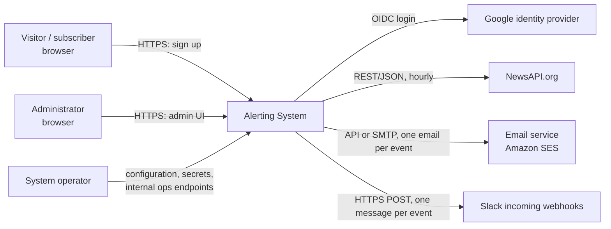
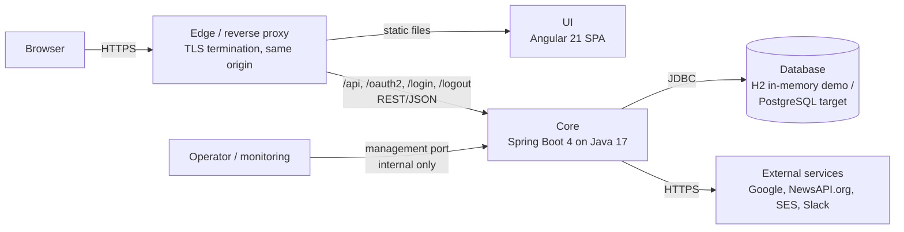
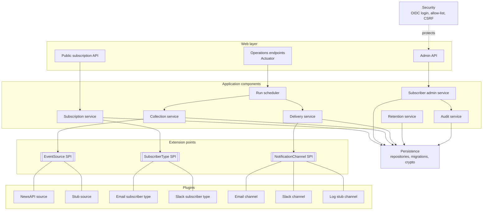
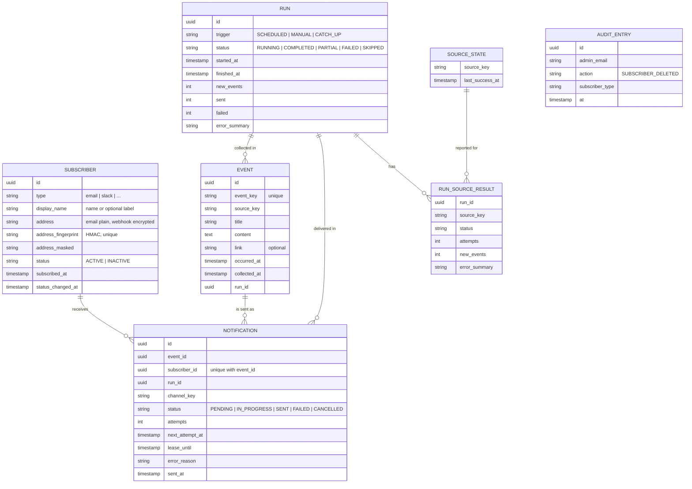
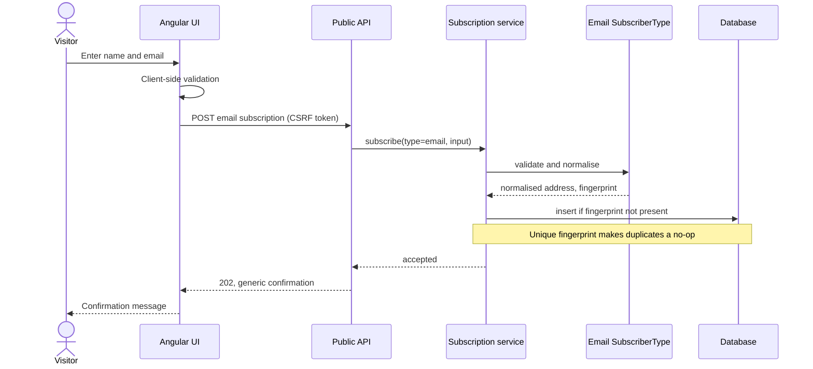
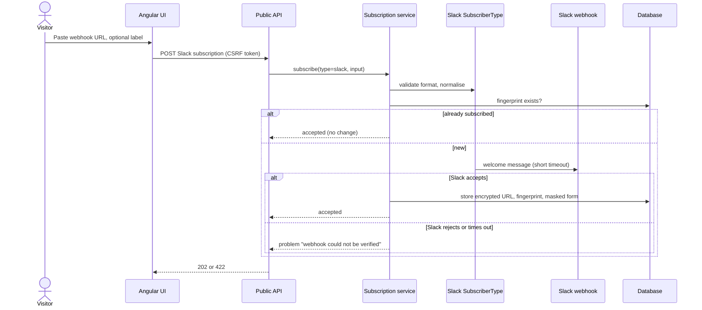
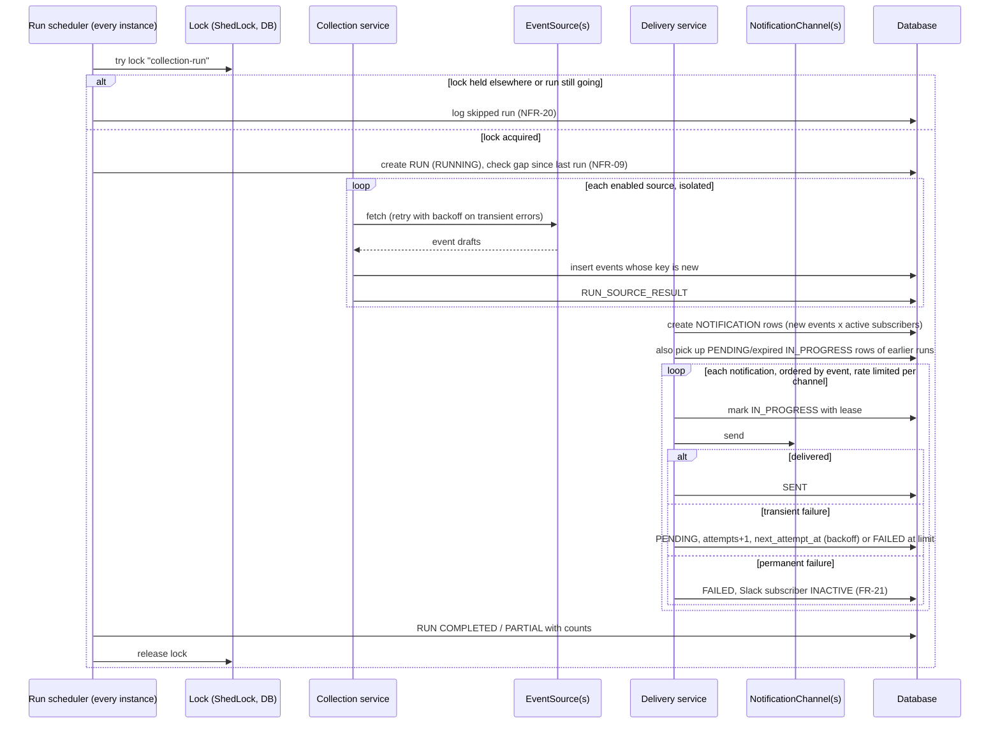
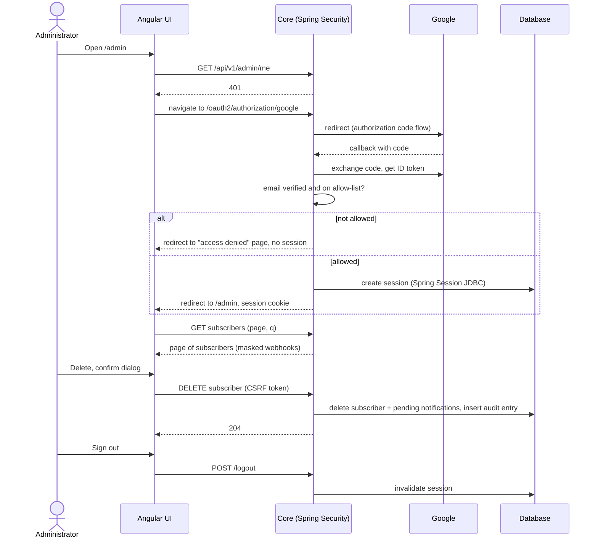
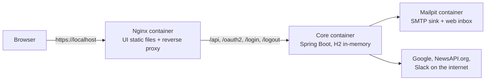
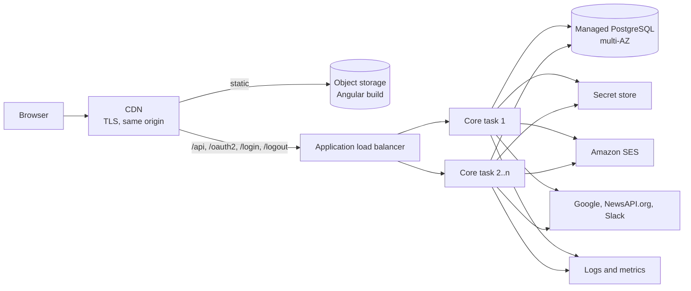

# Alerting System - System Architecture

## 1. Document info

| Item | Value |
|---|---|
| Title | Alerting System - System Architecture |
| Version | 0.1 |
| Date | 2026-09-30 |
| Status | Draft |
| Author | Senior System Architect (Claude Code, `system-architect` skill) |
| Input documents | `docs/01-requirements-specification.md` v0.3 (binding scope); `docs/00-project-documentation.md` Section 5 "Define system architecture and constraints" (binding tech stack and constraints); `CLAUDE.md` (working agreements) |

How to read this document:

- Everything marked **Proposed** (all ADRs in Section 14) is a recommendation. The user makes the final decision.
- Requirement IDs (`FR-xx`, `NFR-xx`, `CON-xx`, `ASM-xx`, `Q-xx`, `RSK-xx`) refer to the requirements specification v0.3. Removed IDs (FR-06, FR-07, FR-22, NFR-06, RSK-01, RSK-02, RSK-03, RSK-10) are intentionally not used.
- Architecture risks are `ARSK-xx`, architecture open questions are `AQ-xx` (Section 16).
- The document stays at architecture level: no source code, DDL, full payloads or complete configuration files.

## 2. Introduction

### 2.1 Purpose and scope

This document describes how the Alerting System is structured: its containers, the components of the core, the extension points for sources, subscribers and channels, the data model, the API, the runtime flows, the deployment and the cross-cutting concerns. It is the input for implementation (step 6 of the project plan).

In scope: everything needed to implement the Must and Should requirements of the specification v0.3. Out of scope: all items in Section 4.2 of the specification (preferences, unsubscribe, digests, extra sources and channels, privacy and anti-spam compliance work, freshness). The design must not block them, and Section 7 shows where they would plug in.

### 2.2 Architectural drivers

| Driver | Requirements | What it means for the architecture |
|---|---|---|
| Extensibility of sources, subscribers and channels | FR-13, FR-18, NFR-14, Section 5 constraint | Explicit SPIs; new implementations are new modules plus configuration, no change to existing components. |
| Hourly, non-overlapping, idempotent collection and delivery | FR-10, FR-11, FR-14, FR-20, FR-32, FR-35, NFR-09, NFR-20 | Scheduler with a cluster-wide lock, unique event keys, one persisted notification record per event and subscriber. |
| Fault isolation and retries | FR-12, FR-19, FR-21, NFR-07, NFR-08 | Per-source and per-notification error handling, retries with backoff, rate limiting per channel. |
| Scalable, fault-tolerant, cloud ready | Section 5 constraint, NFR-10 | Stateless core instances, externalised configuration and secrets, health probes, graceful shutdown, shared session and lock state in the database. |
| Replaceable persistence | Section 5 constraint | In-memory database for the demo behind JPA and schema migrations; persistent database by configuration. |
| Admin security | CON-02, FR-23, FR-24, FR-29, NFR-01, NFR-02, NFR-05 | Server-side Google OIDC login, allow-list check, session timeout, CSRF protection. |
| Protection of secrets | NFR-03, NFR-04, RSK-06 | Secrets outside the repository; webhook URLs encrypted at rest and masked. |
| Observability | NFR-16, NFR-17, RSK-08 | Run records, structured logs without personal data, health and metrics endpoints. |
| CET time zone | CON-10, ASM-03 | One configured Central European zone for scheduling and all displayed times. |
| Demo scale | ASM-10, NFR-10 | Up to 5,000 subscribers and a few tens of events per run; simple in-process delivery is enough, scale-out path documented. |

### 2.3 Binding constraints

From Section 5 of the project documentation:

- Web application; separate implementation of **Database**, **Core** and **UI**.
- Scalable and fault-tolerant, cloud ready.
- Separate core components with abstractions for **Sources**, **Subscribers** and **Channels** (for example AWS SES for email).
- UI best practices.
- In-memory database for the demo, with the option of a persistent database later.
- Technologies: **Java 17, Spring Boot 4, Angular 21, NPM, Gradle, Git**.

From the specification: CON-01 to CON-12 (notably Google login, NewsAPI.org as the only source, Slack incoming webhooks, hourly collection with one message per event, CET, demo scope).

## 3. Technology stack

Version checks were done on 2026-09-30.

| Layer | Technology | Version | Notes and source of the version check |
|---|---|---|---|
| Language (core) | Java (OpenJDK distribution, e.g. Eclipse Temurin) | 17 (binding) | Spring Boot 4.x "requires at least Java 17 and is compatible with versions up to and including Java 26" (Spring Boot 4.1.0 system requirements, via context7 `/spring-projects/spring-boot/v4.1.0`). Compatible. Java 17 means no virtual threads (Java 21+); delivery uses bounded thread pools instead. |
| Application framework | Spring Boot | 4.1.x recommended (4.1.1 is the latest), see ADR-15 | Spring Boot 4.0 (released 2025-11) OSS support ends 2026-12-31; 4.1 (released 2026-06) OSS support until 2027-07-31 (endoflife.date/spring-boot). Boot 4 brings Spring Framework 7, Spring Security 7, Jakarta EE 11 level APIs, Hibernate 7, Jackson 3, Tomcat 11; Undertow removed (Spring Boot 4.0 release notes, GitHub wiki). Boot 4 uses modular starters, for example `spring-boot-starter-webmvc` replaces the deprecated `spring-boot-starter-web`, and Flyway and the H2 console are separate modules (context7). |
| Build (core) | Gradle | 9.x (8.14+ also supported) | The Spring Boot 4 Gradle plugin requires Gradle 8.14 or later, or 9.x (context7, `SpringBootPlugin` and system requirements page). |
| Persistence | Spring Data JPA (Hibernate 7), Flyway | Managed by Spring Boot | See ADR-04. |
| In-memory database (demo) | H2 | Managed by Spring Boot | See ADR-04. |
| Persistent database (target) | PostgreSQL | A currently supported major version | See ADR-04, ADR-14. |
| Scheduling lock | ShedLock (JDBC lock provider) | 7.x | ShedLock 7.x needs JVM 17 and is tested with Spring 7.0 and Spring Boot 4.x (ShedLock README/RELEASES on GitHub). See ADR-05. |
| Resilience | Resilience4j (`resilience4j-spring-boot4`) | 2.4.x | Spring Boot 4 module added in 2.4.0 (resilience4j GitHub, issue #2421). Alternative: Spring Framework 7 core `@Retryable` / `RetryTemplate` / `@ConcurrencyLimit` (spring.io blog 2025-09-09, Spring Framework reference "Resilience Features"). See ADR-07. |
| Admin authentication | Spring Security 7 OAuth2 Client (OIDC login with Google), Spring Session JDBC | Managed by Spring Boot | See ADR-03. |
| Email (cloud) | Amazon SES via AWS SDK for Java v2, or Spring Cloud AWS 4.0 SES starter | Spring Cloud AWS 4.0.x | Spring Cloud AWS 4.0 is aligned with Spring Boot 4 and Spring Framework 7 and supports SES as a Spring Mail implementation (awspring GitHub releases). See ADR-08. |
| Email (local) | Spring Mail (SMTP) against Mailpit | Managed by Spring Boot | Local mail sink for development. |
| API documentation | springdoc-openapi | 3.x (3.1.1 latest stable at time of check) | "springdoc-openapi 3.x is compatible with spring-boot 4" (springdoc.org FAQ). Java 17 baseline of springdoc 3.x not confirmed on the FAQ page; verify before adoption. See ADR-13. |
| Observability | Spring Boot Actuator, Micrometer (1.16 line with Boot 4), structured logging | Managed by Spring Boot | Boot 4 adds an OpenTelemetry starter (release notes). |
| UI framework | Angular | 21 (binding) | **Flag:** Angular 21 (released 2025-11-19) has been in **LTS since 2026-06-03** (critical fixes and security patches only) until 2027-06; Angular 22 is the active version (angular.dev/reference/releases). Compatible with the stack; see AQ-01. |
| UI toolchain | Node.js, NPM, TypeScript | Node 22 or 24 LTS; TypeScript >=5.9 <6.0 | Angular 21 supports Node `^20.19.0 \|\| ^22.12.0 \|\| ^24.0.0`, TypeScript `>=5.9.0 <6.0.0`, RxJS `^6.5.3 \|\| ^7.4.0` (angular.dev/reference/versions). Node 20 is past end of life, so Node 22 or 24 is recommended. |
| UI components | Angular Material and CDK | 21.x (same major as Angular) | See ADR-12. |
| UI tests | Vitest (Angular CLI default), Playwright for end-to-end | Managed by Angular CLI | New Angular CLI projects use Vitest as the default unit test runner (angular.dev/guide/testing, via context7). |
| Source control | Git | - | Binding. |
| Containers | Docker / OCI images, Docker Compose locally | - | See ADR-14. |

Compatibility summary: **no incompatible combination found.** Java 17 is the minimum for Spring Boot 4, Gradle 9 is supported, and all recommended libraries have Spring Boot 4 compatible lines. Two points are flagged, not changed: Angular 21 is already in LTS (AQ-01), and Spring Boot 4.0 leaves OSS support at the end of 2026 (ADR-15).

## 4. System context

| External system | Interaction | Requirements |
|---|---|---|
| Google identity provider | OAuth 2.0 / OpenID Connect authorization code flow for administrators. | CON-02, FR-23, FR-24 |
| NewsAPI.org | Top headlines, one request per run with the default single query. | CON-03, CON-09, FR-08, RSK-04 |
| Amazon SES (or SMTP) | One email per event and subscriber. | FR-15, NFR-19 |
| Slack incoming webhooks | One POST per event and Slack subscriber; welcome message at sign-up. | CON-04, FR-04, FR-16 |

## 5. Container view

| Container | Technology | Responsibility | Communication |
|---|---|---|---|
| UI | Angular 21 SPA, built with NPM and the Angular CLI, served as static files (Nginx container locally, object storage + CDN in the cloud) | Public sign-up pages, admin pages. No business logic beyond input validation for usability. | Loaded by the browser over HTTPS; calls the Core REST API on the same origin. |
| Edge / reverse proxy | Nginx locally; load balancer + CDN in the cloud | TLS termination (NFR-01), same-origin routing of UI and API paths, forwarding headers. | HTTPS in, HTTP(S) to UI and Core. |
| Core | Spring Boot 4 application (one deployable, modular inside), Java 17, Gradle | REST API, admin authentication, scheduled collection and delivery, retention jobs, integration with external services. Stateless between requests; session, lock and business state are in the database. | REST/JSON over HTTPS; JDBC to the database; HTTPS to external services; Actuator on a separate management port. |
| Database | H2 in-memory (demo, embedded in the Core JVM) or PostgreSQL (persistent target) | Subscribers, events, runs, notifications, audit entries, plus technical tables (scheduler lock, HTTP sessions, migration history). | JDBC. |

Note on "separate Database, Core and UI": in the demo profile H2 runs **inside** the Core process, so the separation of the database is logical (own persistence module, own migrations, own configuration group) rather than physical. With the PostgreSQL profile it is a separate container. See ADR-04 and ARSK-01.

## 6. Component view of the core

### 6.1 Components

| Component | Responsibility | Requirements |
|---|---|---|
| Public subscription API | REST endpoints for email and Slack sign-up; input validation; uniform response for new and duplicate subscriptions. | FR-01 to FR-05, NFR-05 |
| Subscription service | Delegates to the matching `SubscriberType` to validate, normalise, verify and store; enforces uniqueness through the address fingerprint. | FR-01 to FR-05, ASM-08 |
| Admin API | List (paged, searchable) and delete subscribers; current admin info. | FR-25 to FR-27 |
| Subscriber admin service | Paged search, deletion of personal data, cancellation of pending notifications, audit entry. | FR-25 to FR-28, FR-30 |
| Security | Google OIDC login, allow-list check, session timeout, logout, CSRF, security headers. | FR-23, FR-24, FR-29, NFR-02, NFR-05 |
| Run scheduler | Triggers the hourly run in the CET zone, acquires the cluster-wide lock, creates the run record, calls collection and then delivery, detects missed runs, supports manual trigger. | FR-11, FR-31, FR-32, FR-34, NFR-09, NFR-20 |
| Collection service | Calls each enabled `EventSource` in isolation with retries, maps items to the standard event format, computes the event key, stores only new events, records per-source results. | FR-08 to FR-13, NFR-07, NFR-08 |
| Delivery service | Creates one notification record per new event and active subscriber, dispatches them through the matching `NotificationChannel` with rate limiting, retries, result classification and inactivation on permanent errors. | FR-14 to FR-21, FR-35, NFR-10 |
| Retention service | Daily clean-up of events (30 days), runs and notifications (90 days) and audit entries (1 year), each configurable. | Section 9 retention, Q-08, NFR-18 |
| Audit service | Records admin deletions without the deleted personal data. | FR-30 |
| Persistence | Repositories, Flyway migrations, attribute encryption and fingerprinting of secrets. | NFR-04, Section 5 constraint |
| Operations endpoints | Health, info, metrics, last runs, manual trigger and resend of failed notifications, on the management port only. | FR-34, NFR-16, NFR-17 |

### 6.2 Module structure

One Git repository, two build systems: Gradle for the core, NPM with the Angular CLI for the UI. Top-level layout (names are proposals):

| Module | Build | Content |
|---|---|---|
| `core/alerting-spi` | Gradle (Java library) | The three SPIs and their value types (event draft, delivery result, notification content). No Spring Boot dependency beyond what is needed for annotations. |
| `core/alerting-app` | Gradle (Spring Boot application) | Web layer, application components, security, scheduling, persistence, Flyway migrations. Package by feature: `subscription`, `admin`, `collection`, `delivery`, `run`, `retention`, `audit`, `security`, `persistence`, `config`. |
| `core/source-newsapi` | Gradle (library) | NewsAPI.org `EventSource`. |
| `core/source-stub` | Gradle (library) | Stub `EventSource` producing synthetic events (FR-13 acceptance, demos, tests). |
| `core/channel-email` | Gradle (library) | Email `SubscriberType` and `NotificationChannel`, with SES and SMTP gateway adapters. |
| `core/channel-slack` | Gradle (library) | Slack `SubscriberType` and `NotificationChannel`. |
| `core/channel-log` | Gradle (library) | Stub channel that writes notifications to the log (FR-18 acceptance). |
| `ui` | NPM / Angular CLI | Angular workspace with one application (Section 11). |
| `deploy` | - | Dockerfiles, Docker Compose for local runs, infrastructure notes for the cloud target. |

Rules: plugin modules depend only on `alerting-spi` (and common Spring libraries), never on `alerting-app`; `alerting-app` never depends on a concrete plugin at compile time (plugins are added as runtime dependencies of the application). This keeps NFR-14 verifiable; an architecture test (for example ArchUnit) guards the rule.

## 7. Extension points

All three SPIs are plain Java interfaces in `alerting-spi`. Implementations are Spring beans in plugin modules, each with its own configuration group and an `enabled` flag (ADR-10). Adding a source, subscriber type or channel means: new module, new configuration group, and (for subscriber types) a new UI form. No existing component changes.

### 7.1 EventSource (sources)

| Aspect | Design |
|---|---|
| Purpose | Fetch items from one external service and return them as event drafts in the standard format (CON-05). |
| Responsibilities | Unique source key; fetch with its own filters (for NewsAPI.org: country, category, language, page size; Q-03); map items to date and time, title, content, source name, optional link (FR-09); drop items without a title; classify errors as transient or permanent. |
| Not responsible for | Duplicate detection, storage, retries across calls, scheduling. The collection service does these. |
| Main operations (in words) | "key", "fetch new items" (receives the time of the last successful fetch as a hint, so sources that support it can fill gaps, NFR-09). |
| Event key | Computed by the collection service from source key plus the item's stable identity (for NewsAPI.org, the normalised article URL, or title plus published time when no URL exists). Unique in the database (FR-10). A source may supply its own identity. |
| Adding a source | New module implementing `EventSource`, configuration group `alerting.sources.<key>.*`, secrets via the secret store. Future Alpha Vantage, USGS or X sources fit here. |

### 7.2 SubscriberType (subscribers)

| Aspect | Design |
|---|---|
| Purpose | Encapsulate everything that differs between kinds of subscribers: input fields, validation, normalisation, verification, masking. |
| Responsibilities | Type key (`email`, `slack`); validate input (FR-02, FR-04 format check against the Slack incoming webhook pattern); normalise the address (lower-case email, canonical webhook URL); optional verification step (Slack welcome message, FR-04); mask the address for display and logs (NFR-04); declare whether the address is a secret (drives encryption). |
| Relationship to channels | Each subscriber type names the channel key that delivers to it (email → email channel, slack → Slack channel). A future channel can reuse a type or bring a new one. |
| Adding a subscriber type | New `SubscriberType` bean, a public API endpoint variant (Section 9) and a UI form. Storage needs no schema change (ADR-11). |

### 7.3 NotificationChannel (channels)

| Aspect | Design |
|---|---|
| Purpose | Render and deliver one notification (one event to one recipient) through one medium. |
| Responsibilities | Channel key; render the message with title, date and time in CET, source, summary and link (FR-17); send; return a result: delivered, transient failure (retry), or permanent failure (for example Slack "no_service" / 404 / 410, which marks the subscriber inactive, FR-21); declare its pacing limits (global rate, per-recipient rate). |
| Pacing | Email: global rate limit equal to the email service's send rate. Slack: at most one message per second per webhook, honouring `Retry-After` on HTTP 429 ("apps may post no more than one message per second per channel", Slack rate-limit docs). |
| Email gateway | Inside the email channel, a small gateway port with two adapters: Amazon SES (cloud) and SMTP (local Mailpit, or the SES SMTP interface). Selected by configuration (ADR-08). |
| Adding a channel | New module implementing `NotificationChannel` (and usually a `SubscriberType`), configuration group `alerting.channels.<key>.*`. The log stub channel proves this path (FR-18). |

## 8. Data architecture

### 8.1 Logical data model

Notes:

- **Standard event format** (CON-05, FR-09): `occurred_at`, `title`, `content`, `source_key` are mandatory; `link` is optional.
- **Idempotency**: `event_key` is unique (FR-10). The pair (`event_id`, `subscriber_id`) in NOTIFICATION is unique, so an event can never be scheduled twice for the same subscriber (FR-20).
- **Generic subscriber** (ADR-11): type-specific data is limited to `display_name` and `address`; the subscriber type defines their meaning. Slack webhook URLs are encrypted at rest; `address_fingerprint` (keyed HMAC of the normalised address) supports duplicate checks without decrypting (ADR-09, FR-05, NFR-04). Email addresses stay searchable in plain form because admins search by email (FR-26).
- **Sources** are defined in configuration (FR-33); SOURCE_STATE holds only runtime state.
- **Administrators** are an allow-list in configuration, not a table (ASM-05).
- **Timestamps** are stored as instants (UTC). Conversion to CET happens only at the edges: scheduling, message rendering and the UI (CON-10).
- **Technical tables**: ShedLock lock table, Spring Session tables, Flyway history.

### 8.2 Deletion of personal data (FR-28)

Deleting a subscriber removes the SUBSCRIBER row (name, email, webhook URL, label) and deletes its PENDING notifications in the same transaction. Historical NOTIFICATION rows keep only the opaque `subscriber_id` (no foreign-key cascade to a deleted row, or a nullable reference), so run statistics stay correct and no personal data remains. The audit entry stores the admin, action, time and subscriber type only (FR-30).

### 8.3 Persistence approach and migrations

- Spring Data JPA repositories over a relational schema (ADR-04). Schema is owned by **Flyway** migrations, which run at start-up on every database; Hibernate only validates the schema. The same migrations are used for H2 and PostgreSQL; only portable SQL is used, and database-specific scripts are kept in vendor folders if unavoidable.
- H2 runs in PostgreSQL compatibility mode to reduce differences. Integration tests also run against real PostgreSQL (Testcontainers) so the persistent path is exercised.
- **Switching to a persistent database** is a configuration change (profile `postgres`): datasource URL, credentials from the secret store, driver on the classpath. No code change.
- **Consequences of the in-memory choice**: all data (subscribers, events, runs, sessions, locks) is lost on every restart; the database lives inside one Core process, so the demo profile supports **exactly one Core instance**. Multi-instance and failover need the PostgreSQL profile (ARSK-01).

### 8.4 Retention

A daily retention job (scheduled at night in CET, protected by the same lock mechanism) deletes, in batches: events older than 30 days, runs and notifications older than 90 days, audit entries older than 1 year (Q-08, NFR-18). Events are deleted only when no PENDING notification refers to them. The event retention (30 days) is much longer than the NewsAPI.org repeat window, so an old event is not collected and sent again.

## 9. API design

### 9.1 Resource overview

| Group | Resource | Operations | Caller | Security |
|---|---|---|---|---|
| Public | `/api/v1/subscriptions/email` | Create email subscription (name, email) | Anyone | CSRF token; input validation; same response for new and existing address (FR-05) |
| Public | `/api/v1/subscriptions/slack` | Create Slack subscription (webhook URL, optional label); sends welcome message before storing | Anyone | CSRF token; strict Slack webhook URL pattern (also prevents server-side request forgery) |
| Admin | `/api/v1/admin/me` | Get current admin (email, name) | UI admin area | Authenticated session + allow-list |
| Admin | `/api/v1/admin/subscribers` | List with paging and text search (`page`, `size`, `q`) | Admin | Authenticated session + allow-list |
| Admin | `/api/v1/admin/subscribers/{id}` | Delete | Admin | Authenticated session + allow-list + CSRF |
| Auth (Spring Security) | `/oauth2/authorization/google`, `/login/oauth2/code/google` | Start login, OIDC callback | Browser | OIDC authorization code flow with PKCE/state |
| Auth (Spring Security) | `/logout` | Sign out, invalidate session | Admin | CSRF |
| Operations (management port) | `/actuator/health` (liveness, readiness), `/actuator/info`, `/actuator/prometheus` | Read | Load balancer, monitoring | Internal network only |
| Operations (management port) | `/actuator/runs` (custom endpoint) | Last runs and status; trigger a run; resend failed notifications of a run | Operator | Internal network only, plus basic operator credential from the secret store (ADR-16) |

### 9.2 Conventions

- REST with JSON over HTTPS, URL path versioning (`/api/v1`). Spring Boot 4 also offers built-in API versioning support; path versioning is the simplest to see and route.
- Errors use RFC 9457 Problem Details (`application/problem+json`), with field-level validation errors for forms. Error bodies never echo secrets.
- Validation with Jakarta Bean Validation on request objects plus the subscriber type's own checks.
- Paging: zero-based page index, page size capped (for example 100), stable sort by subscription date.
- Time values: ISO-8601 with offset, expressed in CET/CEST (CON-10).
- Subscription creation returns HTTP 202 with the same message for new and duplicate addresses (FR-05). A failed Slack welcome message returns a validation problem and nothing is stored (FR-04).
- The API contract is published as OpenAPI (ADR-13).

## 10. Runtime views

### 10.1 Email sign-up

### 10.2 Slack sign-up

### 10.3 Hourly collection and delivery run

Key rules:

- **Single run in the cluster**: every Core instance has the scheduler, but only the instance that gets the ShedLock lock runs (ADR-05). The lock's maximum hold time is slightly shorter than the interval; a run that is still active when the next one is due causes the next one to be skipped and logged (NFR-20).
- **Isolation**: a source failure is recorded in RUN_SOURCE_RESULT and does not stop other sources or delivery (FR-12, NFR-07). A notification failure affects only that notification (FR-19).
- **Retries**: source calls are retried a few times with exponential backoff within the run (FR-12, NFR-08). Notifications are retried within the run up to a limit, and still-PENDING ones are picked up by the next run; after the configured maximum attempts they become FAILED and are logged (FR-19).
- **No duplicates**: new events only by unique key; notifications only by the unique (event, subscriber) pair; a restarted run skips SENT rows (FR-10, FR-20). The remaining gap is a crash after the external send but before the SENT mark (at-least-once, ARSK-03).
- **Deadline**: the delivery phase stops dispatching shortly before the next scheduled run and leaves the rest PENDING for the next run, which logs the overrun (FR-35).
- **No events, no messages** (ASM-07).
- **Manual trigger and resend** (FR-34): the operations endpoint starts the same flow with trigger MANUAL, or resets FAILED notifications of a run to PENDING and runs delivery only; both use the same lock.

### 10.4 Admin login, list and delete

## 11. UI architecture

| Aspect | Design |
|---|---|
| Application | One Angular 21 workspace with one application; standalone components only (no NgModules). |
| Areas and routing | Public area: email sign-up (default route) and Slack sign-up. Admin area: subscriber list and "access denied" page. The admin area is a lazy-loaded route tree, so public visitors never download admin code. |
| Guards | A functional `canMatch` guard for the admin area asks the Core for the current admin (`/admin/me`); on 401 it starts the server-side login by full-page navigation. The guard is for usability only; the Core enforces security. |
| State | Angular signals in small feature services (for example admin list state: page, query, results, loading, error). No global store library is needed for this size. |
| Change detection | Zoneless change detection (the Angular default for new projects in recent versions) with `OnPush`-style components driven by signals. |
| Forms | Typed Reactive Forms with validators mirroring the server rules. Signal Forms are experimental in Angular 21 and are not used (ADR-12). |
| API client | Typed services on `HttpClient` (`provideHttpClient`), one per resource group; interceptors for error mapping; Angular's built-in XSRF support reads the CSRF cookie and sends the header. Request/response types can later be generated from the OpenAPI contract (ADR-13). |
| Components and styling | Angular Material and CDK (accessible form fields, table with paginator, dialog for delete confirmation), responsive layout for mobile and desktop (NFR-12). |
| Accessibility | WCAG 2.1 AA for public pages (NFR-13): labelled fields, error messages linked to fields, keyboard navigation, focus management after submit, colour contrast; automated checks (axe) in end-to-end tests. |
| i18n | English only (ASM-09). Texts kept in templates; no runtime translation library. |
| Time display | Times come from the API with CET/CEST offsets and are formatted with the `Intl` API using the configured Central European zone, not the browser zone (CON-10). |
| Security in the browser | No tokens in browser storage; the admin session is an HttpOnly, Secure, SameSite=Lax cookie; Angular's default output escaping; a strict Content Security Policy set by the edge. |
| Build and tests | NPM scripts with the Angular CLI; Vitest unit tests; Playwright end-to-end tests against a running stack. |
| Local development | `ng serve` with a dev-server proxy to the Core, so the browser sees one origin as in production. |

## 12. Deployment view

### 12.1 Local and demo deployment

- Docker Compose starts `ui`, `core` and `mailpit`. The stub source can replace NewsAPI.org when no API key is available.
- One Core instance only (in-memory database). Restarting loses all data; this is accepted for the demo.
- The Google OAuth client must allow the local redirect URI.

### 12.2 Cloud-ready target deployment (reference: AWS, ADR-14)

| Concern | Behaviour |
|---|---|
| Scaling | Core instances are stateless; add instances behind the load balancer for API load. Sessions are in the database (Spring Session JDBC), so any instance can serve any admin request. |
| Scheduled work | Runs on exactly one instance per run through the database lock. If that instance dies, the lock expires, and leased notifications become available again for the next run. |
| Failover | Load balancer health checks use the readiness probe; managed PostgreSQL with a standby. |
| Graceful shutdown | Spring Boot graceful shutdown; the delivery loop stops taking new notifications, in-flight ones finish or their lease expires. |
| Configuration | Spring profiles (`local`, `demo`, `postgres`, `aws`) and environment variables; no environment-specific values in the image. |
| Secrets | NewsAPI.org key, Google client secret, email credentials, database password, encryption and fingerprint keys come from a secret store (AWS Secrets Manager in the reference target, environment variables locally), never from the repository (NFR-03). |
| Delivery scale-out (later) | Replace the in-process loop with several workers claiming notification rows (row locking with skip-locked on PostgreSQL) or a message queue per channel, without changing the SPIs (NFR-10). |

## 13. Cross-cutting concerns

### 13.1 Security

- HTTPS everywhere through the edge; HSTS; secure cookies (NFR-01).
- Admin: Spring Security OIDC login with Google; the ID token must have a verified email that is in the configured allow-list (compared case-insensitively); all other accounts get "access denied" and no session (FR-24). Session inactivity timeout 30 minutes, configurable (NFR-02). Logout invalidates the session (FR-29).
- CSRF protection for all state-changing requests, public and admin, using the cookie-to-header pattern supported by Angular (NFR-05).
- Server-side validation of all input; JSON responses only; security headers (CSP, X-Content-Type-Options, frame protection) at the edge.
- Webhook URLs encrypted at rest with an application key and masked in UI and logs (NFR-04, ADR-09). Only URLs matching the Slack incoming webhook pattern are ever called, which also blocks server-side request forgery through the sign-up form.
- Operations endpoints only on the management port, not routed by the load balancer (ADR-16).
- Privacy and anti-spam compliance and form abuse protection are out of scope (CON-11); FR-07 was removed, so no bot protection is designed. The design leaves room for a rate limiter filter on the public API later.

### 13.2 Scheduling and time zone

- Collection schedule is a cron expression (default: top of every hour) plus a zone, both in configuration (FR-31, NFR-18). The zone is a regional Central European zone ID so that the CEST switch applies (ASM-03); see AQ-02.
- Delivery has no schedule; it always follows collection (FR-32).
- The retention job has its own nightly cron in the same zone.
- All stored times are UTC instants; rendering in messages and UI uses the configured zone (FR-17, CON-10).
- Daylight saving: on the spring-forward night one hourly slot does not exist; on the fall-back night one local hour occurs twice. The lock and the "last run" check prevent a double run.

### 13.3 Resilience

- Outbound HTTP calls use Spring's `RestClient` with connect and read timeouts per integration.
- Retries with exponential backoff and jitter for transient errors (timeouts, 5xx, 429 with `Retry-After`) for sources and channels (NFR-08); no retries for permanent errors (4xx other than 429).
- Rate limiters per channel (email service send rate) and per Slack webhook (FR-35).
- Optional circuit breaker per external service, so a dead service does not use up the whole run time.
- Library choice in ADR-07.

### 13.4 Observability

- Structured (JSON) logs with a run ID and notification ID as correlation fields. Personal data and secrets are never logged: emails and webhooks appear only in masked form (NFR-16).
- Each run logs a start and end line with counts; RUN and RUN_SOURCE_RESULT rows keep the history (NFR-16).
- Actuator health groups: liveness, readiness (database), plus a custom "last run" health indicator that turns to a warning state when no successful run happened within two intervals (NFR-17, RSK-08, NFR-09).
- Micrometer metrics: runs, new events, notifications sent and failed per channel, delivery duration; exported in Prometheus format or through the OpenTelemetry starter.

### 13.5 Configuration (groups, not keys)

| Group | Content |
|---|---|
| Schedule | Collection cron, zone, retention cron, lock timing. |
| Sources | Per source: enabled flag, filters (country, category, language, page size), timeouts, retry policy; credentials by reference to the secret store. |
| Channels | Per channel: enabled flag, sender identity (email), gateway type (SES or SMTP), rate limits, retry policy, maximum attempts. |
| Delivery | Worker pool size, delivery deadline before next run. |
| Retention | Periods for events, runs/notifications, audit entries. |
| Security | Admin allow-list, session timeout, Google OAuth client registration, encryption and fingerprint key references. |
| Persistence | Datasource per profile, Flyway settings. |
| Management | Management port, exposed endpoints, operator credential reference. |

### 13.6 Testing strategy

| Level | Scope | Tools (high level) |
|---|---|---|
| Unit | Mapping, event key, validation, masking, retry and result classification, UI components and services | JUnit Jupiter and Mockito (versions managed by Spring Boot); Vitest for Angular |
| Architecture | Module dependency rules (plugins depend only on the SPI) | ArchUnit |
| Integration (core) | REST API with security, repositories and migrations on H2 and PostgreSQL, scheduler lock, full run with stubbed externals | Spring Boot test slices, Testcontainers (PostgreSQL), WireMock (NewsAPI.org, Slack), Mailpit or GreenMail (SMTP) |
| Contract | Public and admin API against the OpenAPI description | springdoc-generated contract checked in CI |
| End-to-end | Sign-up flows, admin list and delete with a test identity (Google login replaced by a test OIDC provider in the test profile) | Playwright, axe for accessibility |
| Acceptance of extension points | Enable stub source and log channel by configuration and see events delivered (FR-13, FR-18) | Integration test |

## 14. Architecture Decision Records

All ADRs have status **Proposed**. The user decides.

### ADR-01: Core as a modular monolith

- **Context**: The Core must be separable into components with extension points, scalable and fault tolerant, but the demo scale is small (ASM-10).
- **Options**: (a) One Spring Boot deployable with internal modules (Gradle subprojects, package by feature). (b) Microservices: separate subscription API, collector and dispatcher services with a message broker. (c) One deployable without module boundaries.
- **Decision (recommended)**: (a). Modules for SPI, application and each plugin; module rules checked by tests.
- **Consequences**: Simple to build, run and demo; horizontal scaling of the whole Core; the scheduler lock keeps jobs single-run. Splitting out a dispatcher later is possible because delivery works on persisted notification rows (ADR-06). Option (b) adds a broker and several deployables without a need at this scale.

### ADR-02: UI delivered as a separate static application on the same origin

- **Context**: Separate UI implementation is binding. Admin login uses cookies, and CSRF handling is simplest on one origin.
- **Options**: (a) Separate static build served by Nginx locally and by object storage plus CDN in the cloud, with the API routed on the same origin. (b) Angular build packaged into the Spring Boot jar. (c) Separate origins with CORS.
- **Decision (recommended)**: (a).
- **Consequences**: UI and Core are built, versioned and scaled independently; no CORS; cookies can be SameSite=Lax. Needs an edge/reverse proxy in every environment (Nginx locally, CDN in the cloud).

### ADR-03: Admin authentication as server-side OIDC login with shared sessions

- **Context**: Google login plus allow-list (FR-23, FR-24), session timeout (NFR-02), multiple Core instances.
- **Options**: (a) Spring Security OAuth2 Client login on the Core (backend-for-frontend), HttpOnly session cookie, sessions stored with Spring Session JDBC. (b) SPA performs OIDC in the browser and sends Google ID tokens as bearer tokens to a resource server. (c) (a) with sticky sessions instead of a shared session store.
- **Decision (recommended)**: (a).
- **Consequences**: No tokens in the browser; allow-list and timeout enforced in one place; any instance can serve a request. Sessions live in the same database, so they are lost on restart in the in-memory profile (acceptable). Option (b) puts tokens in the browser and needs its own expiry and revocation handling.

### ADR-04: Persistence with JPA and Flyway; H2 in-memory for the demo, PostgreSQL as the persistent target

- **Context**: In-memory database for the demo, persistent database later without code change; Database separate from Core.
- **Options**: (a) Spring Data JPA (Hibernate 7) + Flyway; H2 in-memory embedded in the Core; PostgreSQL profile. (b) Spring Data JDBC instead of JPA. (c) H2 in-memory in server mode as a separate container, shared by several Core instances. (d) PostgreSQL from day one (Testcontainers/Compose), no in-memory database.
- **Decision (recommended)**: (a), with PostgreSQL integration tests. Option (c) is a fallback if the user wants the database to be a physically separate container in the demo.
- **Consequences**: Standard, well-known stack; migrations are the single schema source for both databases. The demo runs as a single instance and loses data on restart (ARSK-01). H2 compatibility mode is not identical to PostgreSQL, so both are tested.

### ADR-05: Scheduling with Spring scheduling plus ShedLock

- **Context**: Hourly runs, configurable interval, no overlap, one instance per run (FR-11, FR-31, NFR-20).
- **Options**: (a) Spring `@Scheduled` cron with zone, plus ShedLock with the JDBC lock provider, plus the RUN record as a second guard. (b) Quartz with a clustered JDBC job store. (c) External scheduler (Kubernetes CronJob or AWS EventBridge) calling the manual trigger endpoint.
- **Decision (recommended)**: (a).
- **Consequences**: Light-weight, works the same on H2 and PostgreSQL, no extra infrastructure. Lock timing must match the interval (lock held at most slightly less than the interval). Quartz is heavier and adds many tables; an external scheduler ties the design to one platform.

### ADR-06: Delivery through persisted notification records (database outbox)

- **Context**: One message per event and subscriber, exactly-once intent, resumable after restart, rate-limited, scale-out later (FR-14, FR-20, FR-35, NFR-10).
- **Options**: (a) Create a NOTIFICATION row per (event, subscriber) with a unique constraint, then process rows in a bounded in-process worker pool per channel. (b) Send directly in loops without persisting per-notification state. (c) Publish to a message broker (SQS, RabbitMQ) and consume with workers.
- **Decision (recommended)**: (a).
- **Consequences**: Duplicates prevented by the database; restart resumes; resend of failures is a status change (FR-34); per-notification history available for diagnosis. The notification table is the largest table (5,000 subscribers × tens of events per hour), so batch inserts and retention matter. Option (c) is the natural next step for scale-out and can replace the worker without changing the SPIs.

### ADR-07: Resilience library

- **Context**: Retries with backoff, rate limiting per channel and per webhook, optional circuit breakers (NFR-08, FR-35).
- **Options**: (a) Resilience4j 2.4 with the `resilience4j-spring-boot4` module for retry, rate limiter and circuit breaker, configured per source and channel. (b) Spring Framework 7 built-in resilience (`RetryTemplate`, `@Retryable`, `@ConcurrencyLimit`) plus a small own rate limiter. (c) Own implementation.
- **Decision (recommended)**: (a).
- **Consequences**: One library covers all three patterns, configured by properties and visible in metrics. Adds a dependency; the Spring Boot 4 module is recent (2.4.0 initially missed the BOM entry), so pin a verified 2.4.x version. Option (b) has no dependency but no rate limiter or circuit breaker.

### ADR-08: Email delivery through a gateway with SES and SMTP adapters

- **Context**: Section 5 names AWS SES as the example email service; local development needs a mail sink; NFR-19 asks for sender authentication.
- **Options**: (a) Email channel with a gateway port and two adapters: Amazon SES API (AWS SDK for Java v2, SESv2 API) for the cloud and SMTP (Spring Mail) for local Mailpit. (b) Spring Mail only, using the SES SMTP interface in the cloud. (c) Spring Cloud AWS 4.0 SES starter (SES behind Spring's `MailSender`) plus SMTP locally.
- **Decision (recommended)**: (a).
- **Consequences**: Clear error classification from the SES API (throttling vs. permanent rejection) and no SMTP credentials in the cloud (IAM role instead). Two adapters to maintain. Option (b) is the smallest (one adapter) and is a good choice if the user prefers minimal dependencies. SES requires a verified sender domain with SPF, DKIM and DMARC and production access (ARSK-02). Email templates (plain text and simple HTML) are rendered inside the channel.

### ADR-09: Protection of Slack webhook URLs

- **Context**: Webhook URLs are secrets (NFR-04, RSK-06); duplicates must be detected (FR-05).
- **Options**: (a) Application-level authenticated encryption (AES-GCM) of the URL in a JPA attribute converter, plus a keyed HMAC fingerprint for uniqueness, keys from the secret store. (b) Rely on database/disk encryption only. (c) Envelope encryption with a cloud KMS.
- **Decision (recommended)**: (a), with key IDs stored alongside ciphertext so keys can be rotated. (c) can replace the key source later.
- **Consequences**: A database dump alone does not reveal the URLs; duplicate check works without decryption. Losing the key makes stored webhooks unusable; for the in-memory demo this is irrelevant. The same fingerprint mechanism is used for email addresses for a uniform uniqueness rule.

### ADR-10: Extension mechanism with Spring beans and configuration

- **Context**: Sources, subscriber types and channels must be added without changing existing components (NFR-14) and enabled by configuration (FR-33).
- **Options**: (a) SPI interfaces in a separate module; implementations as Spring beans in plugin modules, auto-configured and switched on or off by `enabled` properties; the core collects all beans of each SPI type. (b) Java `ServiceLoader` plugins. (c) External plugin JARs loaded at runtime.
- **Decision (recommended)**: (a).
- **Consequences**: Idiomatic Spring, testable, no class-loading complexity. Adding a plugin needs a rebuild of the application (acceptable). Start-up fails fast if two plugins claim the same key.

### ADR-11: Generic subscriber model

- **Context**: Subscriber abstraction is binding; today email and Slack, more later.
- **Options**: (a) One SUBSCRIBER table with type, display name, address (encrypted when secret), fingerprint, masked form, status; the `SubscriberType` plugin gives meaning to the fields. (b) JPA inheritance (single table or joined) with EmailSubscriber and SlackSubscriber classes. (c) Separate tables per type.
- **Decision (recommended)**: (a), with an optional small attributes column (JSON) if a future type needs extra fields.
- **Consequences**: New subscriber types need no migration; the admin list and delete work across all types uniformly. Less type safety in the database; type-specific rules live in the plugin.

### ADR-12: UI stack details

- **Context**: Angular 21 is binding; UI best practices; WCAG 2.1 AA for public pages; small admin area.
- **Options**: Components: (a) Angular Material + CDK, (b) PrimeNG, (c) own components with a utility CSS framework. Forms: Reactive Forms vs Signal Forms (experimental in 21). State: signals in services vs NgRx.
- **Decision (recommended)**: Angular Material + CDK, typed Reactive Forms, signal-based services, standalone components, zoneless, lazy-loaded admin area.
- **Consequences**: Accessible components maintained by the Angular team in lockstep with Angular versions; few dependencies. Material's look is generic; theming is possible but limited.

### ADR-13: API contract with springdoc-openapi (code-first)

- **Context**: The UI and tests need a clear contract; the team is small.
- **Options**: (a) Code-first: generate OpenAPI from the Spring MVC controllers with springdoc-openapi 3.x; optionally generate TypeScript types for the UI. (b) Contract-first: write OpenAPI, generate server interfaces and client. (c) No formal contract.
- **Decision (recommended)**: (a); Swagger UI only in local/demo profiles.
- **Consequences**: Low effort, contract always matches code. Verify the springdoc 3.x Java baseline against Java 17 before adoption.

### ADR-14: Deployment target

- **Context**: Cloud ready; SES suggests AWS but the stack itself is cloud-neutral.
- **Options**: (a) OCI container images; Docker Compose locally; AWS reference target with ECS Fargate, application load balancer, managed PostgreSQL (RDS), Secrets Manager, SES, CDN plus object storage for the UI. (b) Kubernetes (any cloud) with Helm charts. (c) A platform service (for example AWS App Runner or a PaaS).
- **Decision (recommended)**: (a) as the documented target; only the local Compose deployment is built for the demo.
- **Consequences**: Stays portable (containers, profiles, environment variables). The cloud target is described but not provisioned; infrastructure as code is a later step.

### ADR-15: Spring Boot 4 minor line

- **Context**: "Spring Boot 4" is binding. 4.0 OSS support ends 2026-12-31; 4.1 is current (4.1.1) with OSS support until 2027-07-31.
- **Options**: (a) 4.1.x. (b) 4.0.x.
- **Decision (recommended)**: (a).
- **Consequences**: Longer free support and current fixes; library versions (ShedLock 7, Resilience4j 2.4, springdoc 3.x, Spring Cloud AWS 4.0) must be checked against 4.1 when pinning.

### ADR-16: Operational functions through Actuator on the management port

- **Context**: Manual trigger and resend (FR-34) and last-run status (NFR-17) are for the operator, not for admins (Q-07: admin UI is list and delete only).
- **Options**: (a) Custom Actuator endpoint on a separate management port, not exposed publicly, protected by an operator credential. (b) Admin REST endpoints and UI buttons. (c) Command-line runner / one-off job.
- **Decision (recommended)**: (a).
- **Consequences**: No scope creep in the admin UI; operators use HTTP tools or monitoring. Needs network rules that keep the management port private.

## 15. Requirements traceability

### 15.1 Functional requirements

| Requirement | Priority | Covered by |
|---|---|---|
| FR-01 | M | Public API, Subscription service, Email SubscriberType, UI public area; 10.1 |
| FR-02 | M | Email SubscriberType validation, Bean Validation, UI form validators |
| FR-03 | M | Public API, Slack SubscriberType, UI Slack page; 10.2 |
| FR-04 | M/S | Slack SubscriberType (pattern check, welcome message); 10.2 |
| FR-05 | M | Address fingerprint unique constraint, uniform 202 response; ADR-09 |
| FR-08 | M | Collection service, NewsAPI source; 10.3 |
| FR-09 | M/S | EventSource mapping, EVENT entity (`link` optional) |
| FR-10 | M | Unique event key; 7.1, 8.1 |
| FR-11 | M | Run scheduler; ADR-05 |
| FR-12 | M | Collection service isolation and retries; ADR-07 |
| FR-13 | M | EventSource SPI, stub source; ADR-10 |
| FR-14 | M | Delivery service, NOTIFICATION rows; ADR-06 |
| FR-15 | M | Email channel; ADR-08 |
| FR-16 | M | Slack channel |
| FR-17 | M | Channel rendering, CET conversion; 13.2 |
| FR-18 | M | NotificationChannel SPI, log stub channel; ADR-10 |
| FR-19 | M | Per-notification status, retries, max attempts; 10.3 |
| FR-20 | M | Unique (event, subscriber), resumable runs; ADR-06, ARSK-03 |
| FR-21 | S | Permanent failure classification, subscriber INACTIVE |
| FR-23 | M | Spring Security OIDC login, admin route guard; ADR-03 |
| FR-24 | M | Allow-list check at login; 13.1 |
| FR-25 | M | Admin API, masked addresses, UI table |
| FR-26 | S | Paged search on display name and email; UI paginator |
| FR-27 | M | Admin API delete, confirmation dialog |
| FR-28 | M | Hard delete of subscriber and pending notifications; 8.2 |
| FR-29 | M | `/logout`, session invalidation |
| FR-30 | S | Audit service, AUDIT_ENTRY |
| FR-31 | M | Cron and zone in configuration; 13.5 |
| FR-32 | M | Delivery always follows collection; 10.3 |
| FR-33 | M | Per-plugin `enabled` flags, secrets by reference; ADR-10 |
| FR-34 | S | Operations endpoint; ADR-16 |
| FR-35 | M | Rate limiters, delivery deadline; ADR-07, ARSK-02 |

### 15.2 Non-functional requirements

| Requirement | Priority | Covered by |
|---|---|---|
| NFR-01 | M | Edge TLS, HSTS; 12, 13.1 |
| NFR-02 | M | ADR-03, session timeout |
| NFR-03 | M | Secret store, profiles; 12.2 |
| NFR-04 | M | ADR-09, masking in UI and logs |
| NFR-05 | M | Validation, CSRF, output encoding; 13.1 |
| NFR-07 | M | Isolation per source, notification and channel; 10.3 |
| NFR-08 | M | ADR-07 |
| NFR-09 | S | Gap detection, "last success" hint to sources, resume of PENDING notifications, last-run health indicator. Limitation: NewsAPI.org top headlines only return current items, so events that dropped off the source during a long outage cannot be recovered (AQ-05). |
| NFR-10 | S | Worker pools per channel, ADR-06 scale-out path; limited by email quota (ARSK-02) |
| NFR-11 | S | Small paged queries, indexes on search fields, static UI via CDN |
| NFR-12 | M | Angular Material responsive layout |
| NFR-13 | S | 11 Accessibility, axe checks |
| NFR-14 | M | ADR-10, module rules; 6.2, 7 |
| NFR-15 | M | 13.6 testing strategy; build and run procedure documented in the implementation phase |
| NFR-16 | M | 13.4 |
| NFR-17 | S | Operations endpoint, last-run health indicator; ADR-16 |
| NFR-18 | M | 13.5 configuration groups |
| NFR-19 | S | ADR-08, verified sender domain |
| NFR-20 | M | ADR-05, lock plus RUN guard |

### 15.3 Uncovered requirements

None. All Must and Should requirements are covered. Two are covered only partially because of external limits, not because of the design: NFR-09 (recovery of missed events depends on what the source still returns) and NFR-10 (5,000 email subscribers × tens of events per hour exceeds default email sending quotas, ARSK-02).

## 16. Risks and open questions

### 16.1 Architecture risks

| ID | Risk | Impact | Mitigation / proposed default |
|---|---|---|---|
| ARSK-01 | In-memory H2 lives inside the Core process: data, sessions and locks are lost on restart, and only one Core instance can run. This conflicts with "scalable and fault tolerant" for the demo profile. | Medium | Accept for the demo; persistent PostgreSQL profile for any multi-instance or cloud run; PostgreSQL integration tests keep that path working (ADR-04). |
| ARSK-02 | Email volume. One email per event and subscriber: 5,000 subscribers × about 30 events = about 150,000 emails per hour, about 42 per second sustained. The SES sandbox allows 200 messages per 24 hours and 1 per second (AWS SES developer guide, "Managing your sending limits"); production quotas must be requested. The free NewsAPI.org plan and a small SES quota cannot meet NFR-10 at full demo scale. | High | For the demo, use few subscribers and Mailpit locally; request SES production access and quota before scaling; rate limiter set to the account's send rate; delivery deadline leaves the rest for the next run and logs it. Product decision on volume in AQ-03. |
| ARSK-03 | At-least-once delivery. A crash after the external send but before the SENT mark causes one duplicate when the notification is retried. Neither Slack webhooks nor SES offer idempotency keys. | Low | Short leases, mark SENT immediately after the call, accept rare duplicates as a documented limitation of FR-20. |
| ARSK-04 | Angular 21 is in LTS (critical fixes only) since June 2026; Spring Boot 4.0 OSS support ends 2026-12-31. | Low | Use Spring Boot 4.1.x (ADR-15); decide on Angular 21 vs 22 (AQ-01). |
| ARSK-05 | Slack sign-up makes a synchronous outbound call during a public request (welcome message). Slow Slack responses slow the form; abuse protection is out of scope (CON-11). | Low | Short timeout, strict URL pattern, clear error message; rate limiting can be added later at the edge. |
| ARSK-06 | Loss of the webhook encryption key makes all Slack subscriptions unusable. | Medium | Key in the secret store with backup; key ID stored with ciphertext for rotation (ADR-09). |
| ARSK-07 | NewsAPI.org free plan: 100 requests per day, development use only (RSK-04, CON-09). Retries and manual triggers use the same quota. | Medium | One query per run, capped retries, stub source for testing and demos without quota use. |

### 16.2 Open questions for the user

| ID | Question | Proposed default |
|---|---|---|
| AQ-01 | Angular 21 is binding but is already in LTS; Angular 22 is the active version. Stay on 21 or move to 22? | Stay on Angular 21 as decided for the demo; plan an update to 22 before any longer-lived use (LTS ends 2027-06). |
| AQ-02 | Which zone ID implements "CET"? ASM-03 says CET including summer time. | A regional zone ID such as `Europe/Budapest` (same rules as all CET/CEST countries), not a fixed UTC+1 offset. |
| AQ-03 | Email volume at demo scale exceeds typical SES quotas (ARSK-02). Should the demo cap the number of events per run or email subscribers, or should SES production access with a raised quota be requested? | Cap events per run in source configuration (for example 10) for the demo and use Mailpit locally; request SES production access only if a real email demo with many subscribers is planned. |
| AQ-04 | Should the demo database be a physically separate container (H2 server mode or PostgreSQL) to show the Database/Core/UI separation, or is the embedded in-memory H2 enough? | Embedded H2 for `local`/`demo`; a Compose variant with PostgreSQL to show separation and multi-instance behaviour (ADR-04). |
| AQ-05 | NFR-09 asks that missed events are collected after downtime. NewsAPI.org top headlines only return current headlines. Is "collect what the source still returns and resume pending deliveries" acceptable? | Yes; record the gap in the run record and health indicator. |
| AQ-06 | Email gateway: SES API adapter plus SMTP (ADR-08 option a) or SMTP only via the SES SMTP interface (option b)? | Option (a); option (b) if minimal dependencies are preferred. |
| AQ-07 | Where will the demo be hosted: only locally (Docker Compose) or on a cloud account? This decides whether the AWS target (ADR-14) is provisioned. | Local Docker Compose for the demo; the cloud target stays documented. |
